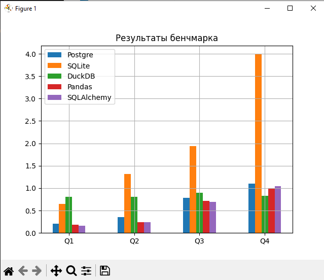

# **DBLab3** 
**Цель:** Написание бенчмарка для сравнения SQL библиотек   
**Выполнил:** Трясков Алексей 22ПИ-2  
**Язык:** Python
___
# Результаты запуска бенчмарка

Ниже приведены результаты запуска программы на 30 тестов с данными из файла 200Мб. 

  

```cmd
Results of benchmark:
Postgre  0.20256564 0.3536344 0.7855989733333334 1.09746665
SQLite  0.6516666333333334 1.31453333 1.9384878833333332 3.9866214233333337
DuckDB  0.81140001 0.8093666 0.89419997 0.8310000666666666
Pandas  0.18573216 0.24390020333333334 0.7128399033333334 1.0026010633333333
SQLAlchemy  0.16453734 0.23629996333333333 0.6949894833333333 1.0458001566666666
```
Программа сразу выводит результат в виде текста и графика. 

По графику видно, что худшей библиотекой оказалась SQLite. Лишь в 1ом запросе она обогнала DuckDB. Дальше же время работы увеличивается быстрее других библиотек. И на 4ом запросе требуется уже 4 секунды на получение результата, когда другим необходимо чуть больше секунды.

Самой стабильной себя показала DuckDB. Время работы этой библиотеки всегда +- одно и то же - приблизительно 0.8 секунд. На последнем запросе это и вовсе лучший результат. Однако на маленьких запросах приходится ждать, и тут то DuckDB проигрывает остальным.

Postgre, Pandas, SQLAlchemy показали себя +- одинаково по времени. Скорость их работы напрямую зависит от сложности запроса. На маленьких запросах это даёт преимущество. На больших запросах они не сильно уступают DuckDB.

___
# Psycopg2 
**Общая оценка**  
  
Высокая скорость работы psycopg2 связана с тем, что эта библиотека работает на основе postgres. Также все таблицы можно удобно смотреть через pgadmin.  

**Впечатления**  
   
**Postgre** показалась мне лучшей библиотекой для работы с бд. Скорость работы довольно высокая. Понятные обращения к бд через язык SQL. Много хороших гайдов по работе с этой библиотекой. Также хранение бд и подключение к ней происходит через localhost и pgadmin.  
Простота работы и понятность этой библиотеки делают её для меня самой удобной из всех 5 библиотек.

___  
# SQLite

**Общая оценка**

SQLite не имеет многих функций оптимизации, которые предоставляют другие реляционные базы данных, такие как индексацию в памяти и параллельные запросы.  
Также, в отличие от других реляционных баз данных, SQLite не имеет отдельного сервера, что может привести к некоторым ограничениям в производительности, особенно при работе с большими объемами данных.  
В целом, SQLite может быть медленным для определенных типов операций или нагрузок из-за своих ограничений и особенностей.  

**Впечатления**

**SQLite3** показалась мне довольно удобной библиотекой. Однако для ее работы нужно создать .db или .sql файл (через сторонние библиотеки) и работать с ним. Это сильно замедляет работу.  
В целом, библиотека хорошая для работы с .db файлами. Но для более серьёзных целей она не подойдёт, из-за медлительности.
___
# DuckDB

**Общая оценка**

DuckDB использует колоночное хранение данных, что позволяет ему эффективно управлять операциями чтения и агрегации данных.  
Эффективная оптимизация запросов: DuckDB включает в себя оптимизатор запросов, который может преобразовывать запросы для улучшения производительности и выбора наиболее эффективного метода выполнения запроса.  
В целом, DuckDB обеспечивает высокую производительность за счет оптимизации процесса выполнения запросов, работы с памятью и поддержки колоночного хранения данных, что делает его быстрым и эффективным выбором для аналитических задач.

**Впечатления**

**DuckDB** понравилась мне своей простотой. Не надо было искать, как подключаться к бд или писать функции для создания .db файла. Работа идёт напрямую с таблицей. Также её стабильность поражает. На самом времязатратном запросе она показала себя быстрее других. Стабильность и простота делают эту библиотекой лучшим вариантом, если бд хранится в .csv файле.

___
# Pandas

**Общая оценка**

Pandas использует векторизованные операции, что позволяет выполнять операции над данными сразу для целого массива, вместо итераций по отдельным элементам. Это улучшает производительность и скорость обработки данных.  
Под капотом Pandas использует оптимизированные структуры данных, которые позволяют эффективно хранить и манипулировать данными.

**Впечатления**

**Pandas** показалась мне хорошей библиотекой. Ещё мне кажется, что она помогает удобно работать с данными тем, кто не знает SQL - через методы, а также как с массивом. Показалось практичной работа и правка .csv файлов, с помощью готовых методов (например .read_csv, .to_sql и тд).  
Но не всё так гладко. Когда мне понадобилось использовать язык SQL, долго искал информацию, как это сделать. В итоге подключился через create_engine к posgre бд. Наверно отсюда и схожее с psycopg2 время. Подключаясь к бд через sqlite, время ухудшилось до результатов sqlite3 библиотеки.  
По итогу, Pandas- хорошая библиотека, но для выполнения SQL-запросов я бы выбрал что-то другое.

___

# SQLAlchemy

**Общая оценка**

SQLAlchemy использует ООП, для работы с таблицами. Таблицы - объекты, для них есть методы.  
Скорость работы SQLAlchemy зависит от нескольких факторов, включая тип базы данных, объем данных, количество запросов и структуру таблиц. Однако, общая скорость работы SQLAlchemy в Python обычно считается достаточно высокой.

**Впечатления**

**SQLAlchemy** показалась мне неудобной библиотекой, несмотря на то что create_engine выручала меня в работе с другими библиотеками. Все проблемы шли от того, что большинство гайдов были про создание классов в алхимии, а не работу с готовой бд. Однако наработки в пандасе помогли подключить алхимию к постгресу и использовать понятный SQL язык. Скорее всего из-за этого подключения, у этих 3х библиотек схожее время работы.

___
# Как запустить?
Для запуска необходимо клонировать репозиторий.  

```
git clone https://github.com/4rterxxx/DBlab3.git
```


Далее необходимо установить библиотеки, используемые в бенчмарке.
```
pip install -r /path/to/requirements.txt
```
Где */path/to/requirements.txt* - путь к файлу requirements.txt

Почти готово! Осталось только настроить файл config.py, в котором можно выставить параметры бенчмарка.
```Python
# Имя файла с таблицей

name_of_file = "data_wo_unnamed.csv"

# data for postgres, pandas, sqlalchemy

host = "localhost"
user = "postgres"
password = "postgres"
db_name = "postgres"
port = 5432

# data for SQLite3

name_of_file_db = "sqlite.db" # Указать адрес файла с бд в формате .db или .sql/ При отсутствии такого файла оставить пустым (файл создастся из автоматически .csv с именем sqlite.db)

# Количество тестов

num_of_tests = 10

# Какие библиотеки сравниваем

isPostgre = True
isSQLite = True
isDuckDB = True
isPandas = True
isSQLAlchemy = True

# True - идёт в сравнение, False - не идёт
```
Все настройки подписаны (*см. комментарии*)

Остаётся только запустить файлик **main.py** и ждать результат бенчмарка!
